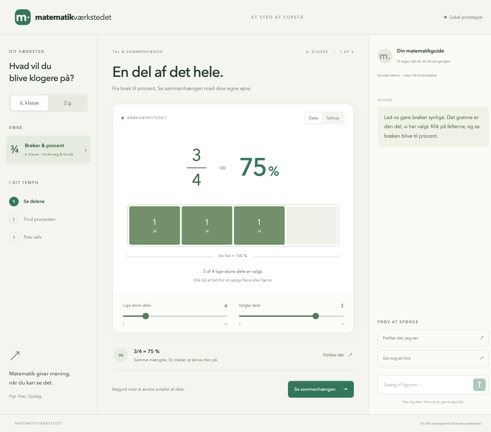

# Matematikværkstedet

Lokal prototype til 6. klasse og 2.g. Interaktive brøker, procent, tallinje og funktioner med tangenter. En rigtig AI-guide kan svare og ændre figuren via dit lokale Codex-login og ChatGPT-abonnement. AI kan slås til og fra.

Målet er en pluginbaseret matematikunderviser med dynamiske visualiseringer og
varierede øveopgaver, der træner begrebsforståelse. Generative prøvesæt er endnu ikke implementeret. AI-guidens sceneadgang er
afgrænset til de to eksisterende visualiseringer.

**Gratis til privat brug med egne børn.** Brug på skoler, i organisationer,
til undervisning af andres børn eller i en virksomhed kræver en særskilt
skriftlig aftale med projektejeren. Det gælder også gratis institutionsbrug.
Koden er offentligt tilgængelig (*source available*), men har ikke en
open-source-licens. Se [licensen](LICENSE.md) og
[forklaring af vilkårene](docs/LICENSING.md).



## Start

Forudsætning: Bun 1.4.0, som prototypen er afprøvet med. Versionen står også i
`.bun-version` og `package.json`. Dependencies er låst i `bun.lock`.

```sh
bun install --frozen-lockfile
bun run dev
```

Åbn http://127.0.0.1:4317. `dev` bygger brugerfladen og starter Bun-serveren. Efter kodeændringer: byg igen med `bun run build`, og genindlæs browseren. Genstart serveren efter ændringer i serverkode.

```sh
bun run typecheck
bun test
bun run build
bun run start
```

For rigtig AI: installér Codex CLI, kør `codex login` med ChatGPT, og
kontrollér med `codex login status`. [Opsætning og adapterdesign](docs/AI-PROTOTYPE.md).
Uden AI: `AI_PROVIDER=off bun run dev`. Abonnementets Codex-grænser gælder.

Alternativ port: `PORT=4320 bun run start`.

## Opbygning

- `server.ts`: Bun-server og katalog-API.
- `src/lessons.ts`: To lektionsplugins registreret med Cordis.
- `src/main.tsx`: React-brugerflade, Mafs-graf og guidede forløb.
- `src/ai/`: Udskiftelig AI-provider, Codex CLI-adapter og validerede scenedata.
- `src/math.ts`: Fælles beregninger og dansk talinput.
- `research/PROTOTYPE-RESULTS.md`: Udførte kontroller og afgrænsning.
- `research/`: Produktkrav, prøveanalyse og biblioteksresearch.
- `docs/`: Dokumentationsoversigt og skærmbilleder.
- `materialer/`: Kildemanifest; downloadede prøver holdes lokalt uden for Git.
- `AGENTS.md`: Arbejdsvejledning for kodeagenter.

Serveren er kun tilgængelig på denne computer. Ingen elevlogin eller samtalelagring. Med AI til sendes spørgsmål, kort historik og figur til OpenAI via Codex. Se SCRATCHPAD.md for de langsigtede idéer.

## Dokumentation og bidrag

Start med [krav og designnoter](research/PRODUCT-REQUIREMENTS.md) og
[dokumentationsoversigten](docs/README.md). Før kodeændringer, læs
[AGENTS.md](AGENTS.md). Samlet kodekontrol: `bun run check`.

Næste planlagte udviklingsforløb er [FP9-epic'en](docs/epics/FP9-EXAM-TRAINING.md):
træning i prøven med og uden hjælpemidler, begge med valgfri AI som støttehjul.
Se [researchgrundlaget](research/fp9/FOUNDATION.md) og
[oplevelsesbeskrivelsen](docs/FP9-EXPERIENCE.md). Funktionerne er endnu ikke bygget.

## GitHub

Projektnavn: **Matematikværkstedet**. Teknisk repository- og pakkenavn:
`matematikvaerkstedet`. Den lokale branch hedder `main`.

Repository: [mikkelkrogsholm/matematikvaerkstedet](https://github.com/mikkelkrogsholm/matematikvaerkstedet).

```sh
git clone https://github.com/mikkelkrogsholm/matematikvaerkstedet.git
cd matematikvaerkstedet
```

Remote `origin` peger på dette repository. Ændringer på `main` kan pushes med
`git push origin main` efter kontrol og commit.
